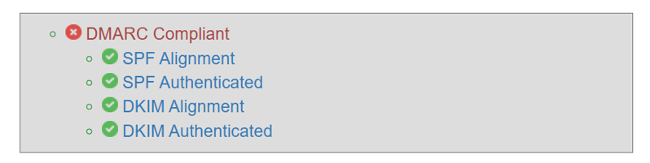
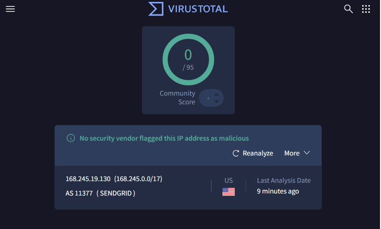

This folder stores all screenshot evidence used throughout the Email Security Analysis Lab.
Screenshots are not embedded inside Markdown files—they are linked.
GitHub requires images to exist as real files inside the repository for them to display correctly.

Keeping screenshots here ensures:

Clear separation between analysis, raw samples, labels, and visual evidence

A consistent folder structure that scales as additional email analyses are added

Recruiters and reviewers can easily browse the evidence supporting each investigation

Markdown links inside /analysis remain valid and never break

## Folder Organization

Screenshots are organized per email case using this structure:

screenshots/
│
└── email-01/
    ├── email-01-header-full.png
    ├── email-01-bottom-received.png
    ├── email-01-mxtoolbox-header.png
    ├── email-01-mxtoolbox-dns.png
    ├── email-01-virustotal-ip.png
    ├── email-01-whois.png
    ├── email-01-authentication-results.png
    ├── email-01-urlscan.png
    ├── email-01-final-summary.png
    └── email-01-label.png

Add additional folders as needed:

screenshots/email-02/
screenshots/email-03/
...

This keeps your repo clean and scalable.

🧩 Screenshot Naming Standard

Use this naming format:

email-XX-[description].png

Example:

screenshots-01-Full-Header.png

email-01-authentication-results.png

email-01-virustotal-ip.png

email-01-final-summary.png

This makes files easy to read and helps recruiters understand what each screenshot shows.

## Markdown Linking Standard

Inside analysis files, link images like this:

screenshots-01-Full-Header.png

These links will render correctly as long as the files exist in the /screenshots/email-01/ directory.

## Why Screenshots Are Stored Separately

Screenshots are kept separate because:

Markdown cannot embed image files internally

Images must exist as separate .png files

Storing all screenshots here avoids clutter in /analysis or /samples

Recruiters can quickly verify your work by browsing this folder

Keeps the repo organized and professional

Mixing screenshots into other folders causes confusion and broken links.

## Purpose of This Folder

This folder serves as the visual evidence layer of your investigation workflow.
Screenshots here support:

Header extraction

Authentication validation (SPF, DKIM, DMARC)

IP and domain reputation checks

URL analysis

Final labeling

Demonstrating your analyst methodology

This is crucial for showing real-world workflow competence.
